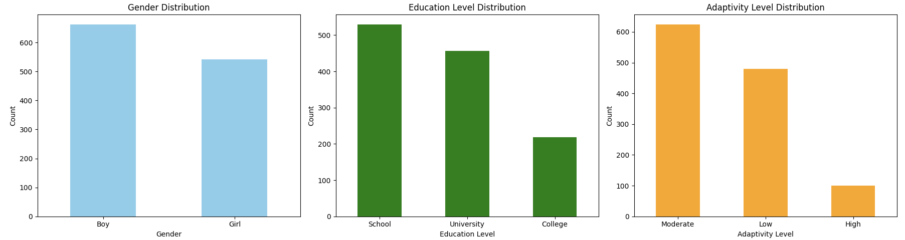
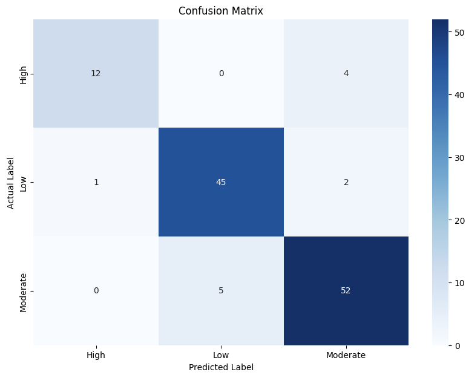

# Evaluation of Student Adaptation in Online Learning Using SVM


## Introduction
With the rise of online learning, especially during the pandemic, it has become essential to evaluate how well students adapt to this mode of education. The success of online learning heavily depends on various factors such as technology access, learning environment, and student readiness. This project aims to develop a predictive model to measure student adaptability to online learning, providing educational institutions and policymakers with insights into how well students cope with this system and identifying areas that need further improvement or support.

## Project Objective
The goal of this project is to build a predictive model using Support Vector Machine (SVM) that assesses how well students and university-level learners adapt to online learning environments. The model will help educational institutions and policymakers in understanding the effectiveness of online learning implementations and highlight areas where students may require additional support.

## Data Source
This dataset consists of information from 8,407 students detailing their experiences with online learning. Key features include gender, age group, education level, institution type, IT student status, location, frequency of power outages (load-shedding), financial condition, internet and network type, class duration, access to Learning Management Systems (LMS), device used for learning, and their adaptability level to online education.


Data Visualization

## Data Processing
The data processing began with data cleaning to eliminate duplicates and handle null values. Steps :
1. Data Cleaning: Removed missing values and handled inconsistencies.
2. Categorical Data Encoding: Converted categorical data in arrays X and Y into numerical format to allow for model processing.

## Model Used: Support Vector Machine (SVM)
Support Vector Machine (SVM) was chosen for this project due to its ability to handle high-dimensional spaces and work well in classification problems. Initially, the SVM model was trained and achieved an accuracy of 74%. However, to further improve the performance, hyperparameter tuning was performed using GridSearchCV, which optimized the model parameters.

### Hyperparameter Tuning
Hyperparameter tuning was applied with the following grid:

```
param_grid = {
    'C': [0.1, 1, 10, 100],
    'kernel': ['linear', 'rbf', 'poly'],
    'gamma': ['scale', 'auto']
}

```

After tuning, the model's accuracy improved significantly from 74% to 90%, making it the best-performing model for this project.

## Results
The SVM model performed well in predicting the adaptability of students to online learning, especially after hyperparameter tuning. Below are the evaluation metrics:

- **Accuracy**: After tuning, the model achieved an accuracy of **90%**.
- **Precision and Recall**: The model demonstrated a balanced performance, showing its ability to correctly classify students into the adaptability levels.

### Classification Report for the Best SVM Model

| Class     | Precision | Recall | F1-Score | Support |
|-----------|-----------|--------|----------|---------|
| High      | 0.92      | 0.75   | 0.83     | 16      |
| Low       | 0.90      | 0.94   | 0.92     | 48      |
| Moderate  | 0.90      | 0.91   | 0.90     | 57      |
| **Accuracy** | **0.90** |        |          | 121     |
| **Macro Avg** | 0.91   | 0.87   | 0.88     | 121     |
| **Weighted Avg** | 0.90 | 0.90  | 0.90     | 121     |

The model achieved high accuracy and balanced precision, recall, and F1-scores across all levels of adaptability, making it an effective tool for assessing student adaptability to online learning.

### Confusion Matrix

Below is the confusion matrix for the tuned SVM model.

## Conclusion
The predictive model developed using Support Vector Machine (SVM) proved to be an effective tool for evaluating student adaptability to online learning. By applying hyperparameter tuning through GridSearchCV, the model’s accuracy was significantly improved from 74% to **90%**, demonstrating its ability to make reliable predictions across different adaptivity levels (High, Low, and Moderate).

The classification report highlighted the following key metrics:
- **High Adaptivity**: Precision 0.92, Recall 0.75, F1-Score 0.83
- **Low Adaptivity**: Precision 0.90, Recall 0.94, F1-Score 0.92
- **Moderate Adaptivity**: Precision 0.90, Recall 0.91, F1-Score 0.90

With an overall **accuracy of 90%** and balanced precision, recall, and F1-scores, the model effectively classifies students into appropriate adaptability categories. This provides valuable insights for educational institutions and policymakers to identify students who may struggle with online learning and implement targeted interventions to support them.

Overall, this model offers a robust approach for assessing the challenges of online education, empowering data-driven decisions to enhance learning outcomes and improve the online learning experience.

## Technologies Used
- Python: Programming language used for data processing and model development.
- TensorFlow: For machine learning and deep learning model development.
- Scikit-Learn: For machine learning model implementation (SVM).
- Pandas: For data manipulation and preprocessing.
- NumPy: For numerical operations.
- Matplotlib: For data visualization and plotting evaluation metrics.
- Seaborn: For enhanced data visualization and creating insightful plots.

## Contributing
Clarissa Sanindita R